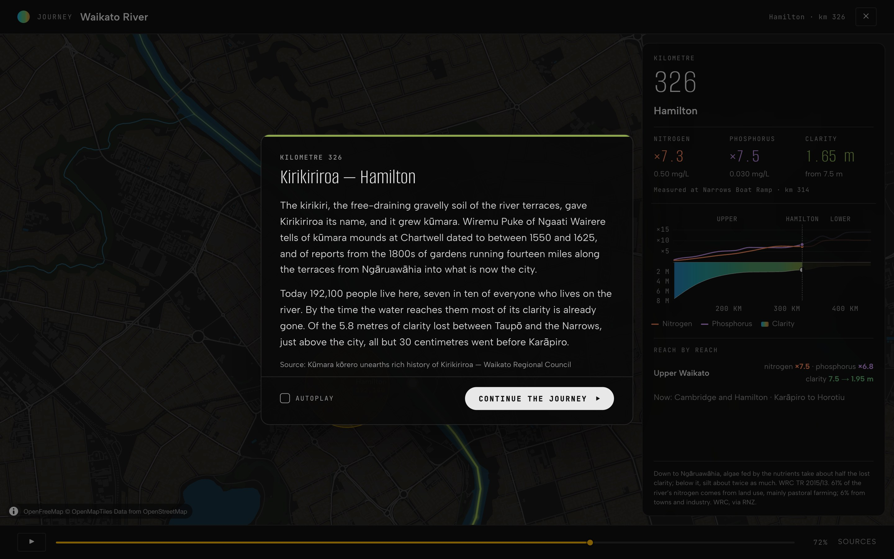

# The Longest Journey

The Waikato River, from the ice on Ruapehu to the Tasman, and what happens to its
water on the way.

**[Take the journey →](https://davidjcrawford.github.io/the-longest-journey/)**



## Dedication

This is for the people who look after the Waikato.

For the field staff who go out to the river every month so there is a record
going back decades. For the people in the labs who run the samples, the
scientists who make sense of them, and everyone at LAWA, Waikato Regional Council,
NIWA and Stats NZ who publishes what they find so that anyone can use it. For the
river iwi, who are its kaitiaki and share in its care. And for the people who
write the region's environmental policy, trying to do right by everyone who
depends on the river, in work that is slow, contested and rarely thanked. Every
number on this site is theirs.

And for my wife, who has spent more than twenty years in environmental
monitoring and policy. It isn't always easy, and you do it to make a difference.
It does. I see it, and I hope you feel seen.

## Why I made it

I've lived beside the Waikato in the middle of Hamilton all my life. I've always
known that the water going past the city isn't the water that leaves Lake Taupō.
Up there it's clear and blue. By the time it reaches us it has turned green and
brown. I wanted to see where that happens, and why, using the measurements
people have been taking for years.

## What it shows

- Where the river leaves Lake Taupō you can see 7.5 metres through the water.
  At Hamilton, 1.65 metres. At Tuakau, 0.65 metres.
- Most of that is lost before the river reaches Hamilton. Of the 5.8 metres
  gone by the edge of the city, 5.5 went before Karāpiro, through the farmland
  and the hydro lakes of the upper river.
- Over the same water, nitrogen rises tenfold and phosphorus fourteenfold.
  Waikato Regional Council finds that algae fed by those nutrients take about
  half the lost clarity down to Ngāruawāhia, and silt about twice as much below
  it.
- 71% of the people who live on the river live in Hamilton. Hamilton, Huntly,
  Ngāruawāhia, Te Kauwhata and towns in Waipā drink from it, and it supplies
  about a fifth of Auckland's water.

The figures are medians of monthly samples at 13 sites, 2004 to 2024. They show
where the water changes, not who changed it.

## The journey

- It starts at the river's source, on the ice on Ruapehu 2,600 metres up, and
  follows the real waterways on the map: the Mangatoetoenui Stream, the
  Tongariro, across Lake Taupō, then the Waikato to Port Waikato and out to sea.
- The line is coloured by how clear the water is: blue leaving the lake, green
  through the hydro lakes, brown below Ngāruawāhia.
- A panel beside the map shows nitrogen, phosphorus and clarity at the last site
  passed, and a graph of all three down the whole river.
- Fourteen short passages along the way cover the river's ecology, its history
  and its standing in law, each with its sources.
- Play, pause, drag along the progress bar, or turn on autoplay and let it run.

## Data and sources

| Source | Used for | Terms |
|:--|:--|:--|
| [LAWA](https://www.lawa.org.nz/download-data) and Waikato Regional Council | Water quality at 13 sites, monthly, 2004–2024 | CC BY 4.0 |
| [NIWA River Environment Classification (REC2)](https://data-niwa.opendata.arcgis.com/datasets/NIWA::river-lines) | The river's length, its source, and the distance axis every figure sits on | CC BY-NC 4.0 |
| [Stats NZ](https://tools.summaries.stats.govt.nz/) | Who lives on the river | CC BY 4.0 |
| [OpenStreetMap contributors](https://www.openstreetmap.org/copyright) | The path the journey follows and where each town is | ODbL |
| [OpenFreeMap](https://openfreemap.org) | The map tiles, fetched live | OpenStreetMap data, ODbL |

The passages also quote and cite Waikato Regional Council reports, the
Parliamentary Commissioner for the Environment, NIWA, the Department of
Conservation, Te Ara, NZHistory, Watercare and others. Every source and its terms
are on the site's [sources page](https://davidjcrawford.github.io/the-longest-journey/sources/)
and in [`Docs/SOURCES.md`](Docs/SOURCES.md).

## Running it locally

You'll need Python 3.10 or newer (the data pipeline uses only the standard
library) and Node 22.12 or newer.

```bash
cd site && npm install && cd ..
make build     # check the data, build the site, then check every internal link
make preview   # serve the built site
```

The emitted data in `site/data/` is committed, so the site builds from the
repository alone. To refresh the data from its sources:

```bash
make sources   # download the source data into .cache/
make emit      # turn it into the JSON the site reads
make verify    # 443 checks against facts the pipeline didn't produce
```

## How it's built

- [Astro](https://astro.build) static site in TypeScript.
- [MapLibre GL](https://maplibre.org) with OpenFreeMap vector tiles, restyled to
  sit back behind the river.
- A Python pipeline with no dependencies. It downloads the sources, places every
  measurement, town and place on one distance axis along REC2's river, builds the
  journey's path from OpenStreetMap's streams and river, and checks the result
  against facts it did not produce.
- Deployed to GitHub Pages by GitHub Actions on every push to `main`.

```text
pipeline/      download, emit and verify the data (Python, standard library only)
site/
  data/        the JSON the site is built from (committed)
  src/lib/     the passages, the map style, the water colours, the graph's curves
  src/pages/   the landing page, the journey, the sources page and the icons
Docs/          SPEC, HANDOFF (where things are up to) and SOURCES (every source and its terms)
```

## Licence

The code is MIT licensed; see [`LICENSE`](LICENSE). The data keeps its own
terms. REC2 is CC BY-NC 4.0, so this site, and anything built from its data,
has to stay non-commercial. Map data © OpenStreetMap contributors.

---

<sub>Not affiliated with any council, ministry, iwi or agency.</sub>
